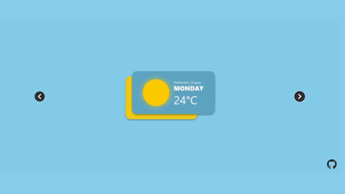
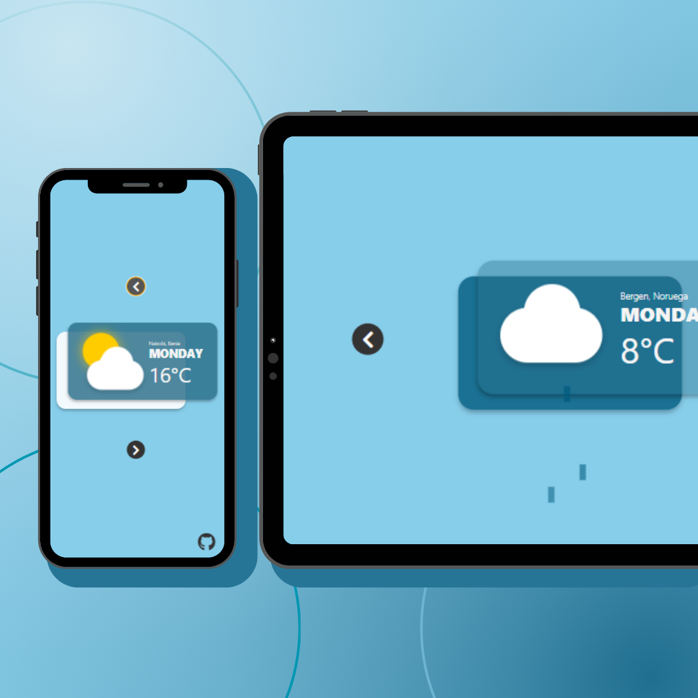

# Weather Icons Creation with HTML and CSS

This project demonstrates how to create animated icons to represent different weather conditions using pure HTML and CSS. Each icon is a visual representation of the weather and is designed with realistic details and animations.

## Available Icons

1. **Bright Sun (Sunny)**: A bright yellow sun with pulsing and glowing animations.

2. **Rain**: A set of raindrops falling from a cloud.

3. **Sun Between Clouds (Partly Cloudy)**: A yellow sun partially covered by a cloud with pulsing and glowing animations.

4. **Cloud**: A white cloud with lateral movement animations.

5. **Storm**: A storm cloud with lightning and raindrops falling.

## How They Work

Each icon is created using HTML elements and styled with CSS. Animations are achieved using CSS keyframes to bring the icons to life. The code is organized into individual containers for each icon, and each container is displayed or hidden based on the current weather conditions.

## Customization

You can customize these icons by adjusting colors, sizes, and animations in the CSS code. Experiment with different styles to fit your specific design and needs.

## Responsiveness

The weather icons are designed to be responsive and will adapt to different screen sizes. The project uses CSS media queries to ensure the icons look great on mobile devices, tablets, and desktop screens.

## Contribution

If you want to contribute to this project or have ideas to enhance the weather icons, we are open to collaborations! Feel free to fork the repository, make improvements, and submit pull requests.

## License

This project is distributed under the MIT License. Please refer to the [LICENSE.md](LICENSE.md) file for more details.

---

© Dev.Eugenius - [GitHub Profile](https://github.com/deveugenius)
